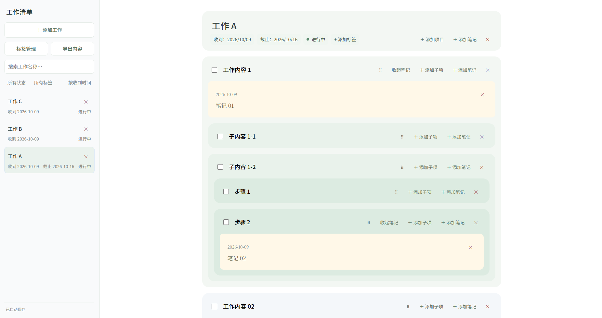

# NoteStrata 1.0.1

NoteStrata 是一款本地运行的网页版工作清单工具，用于把工作拆分为多层项目、子项目和步骤，并在每一层记录独立笔记。

NoteStrata is a local, browser-based work organizer for breaking work into nested projects, subtasks, and steps, with notes available at every level.



## 主要功能

- 多层级拆分工作、项目、子项目和步骤。
- 在工作及各级项目下添加多条笔记。
- 设置收到时间、截止时间和工作状态。
- 创建、选择、重命名和删除标签。
- 按名称搜索，并按状态、标签和收到时间筛选或排序。
- 拖动调整项目顺序。
- 自动保存到本机 JSON 文件，并保留最近一次备份。
- 将现有内容导出为 Markdown 文件。
- 所有数据保存在本机；服务仅监听 `127.0.0.1`，不上传到云端。

## 源码版运行方法

### 要求

- Windows 10 或 Windows 11。
- Python 3.10 或更高版本。
- 不需要安装第三方 Python 包。

### 启动

1. 完整解压源码 ZIP。
2. 双击 `Start-NoteStrata.pyw`。
3. NoteStrata 会在后台启动，并使用 Windows 设置的默认浏览器打开页面。

如果 Windows 没有关联 `.pyw` 文件，可在源码目录打开终端并运行：

```powershell
py -3 app.py
```

程序不会指定 Chrome、Edge 或其他特定浏览器，也不会修改浏览器或 Python 文件关联。

## Windows x64 Portable 版

1. 完整解压 `NoteStrata-1.0.1-Windows-x64-Portable.zip`。
2. 保持 `NoteStrata.exe` 与 `_internal` 文件夹位于同一目录。
3. 普通双击 `NoteStrata.exe`，不要选择“以管理员身份运行”。

当前 portable 构建没有数字签名。Windows 可能显示“未知发布者”“打开文件 - 安全警告”或 Microsoft Defender SmartScreen 提示。确认文件来自本项目后，可选择“运行”或“更多信息 → 仍要运行”。

如果 Edge 提示现有实例正在以提升的权限运行，请选择“是”，让 Edge 以普通权限重启；也可以先关闭所有 Edge 窗口，再正常启动 Edge。NoteStrata 与浏览器都应以普通权限运行。

## 数据与备份

- 工作数据保存在程序目录中的 `tasks.json`。
- 每次覆盖保存前，上一份数据会复制为 `tasks.json.bak`。
- 如需迁移数据，请关闭 NoteStrata 后复制 `tasks.json`；建议同时备份 `tasks.json.bak`。

## 退出程序

请点击左侧底部的“退出”按钮。确认后，NoteStrata 会先保存当前内容，再关闭本地服务，并将工作界面切换为“NoteStrata 已退出”提示页。

受浏览器安全限制，普通网页不能可靠地关闭由用户打开的浏览器标签页。看到退出提示后，请手动关闭该标签页；此时后台服务和 `pythonw.exe`/`NoteStrata.exe` 已经结束，不会继续占用后台资源。不点击“退出”时，NoteStrata 会保持后台运行，方便以后重新打开页面。

如果页面无法正常退出，可使用以下备用方法：

- 源码版：在任务管理器中结束对应的 `pythonw.exe`；如果从终端运行，可在终端按 `Ctrl+C`。
- Portable 版：在任务管理器中结束 `NoteStrata.exe`。

同一目录只会运行一个 NoteStrata 服务实例。再次启动会尝试重新打开已经运行的页面。

## 隐私与安全

NoteStrata 不包含遥测、账号系统或远程服务。浏览器只访问由本机启动的 `127.0.0.1` 地址。

## 许可证

本项目使用 [MIT License](LICENSE)。

---

## English

NoteStrata is a local, browser-based work organizer for breaking work into nested projects, subtasks, and steps, with notes available at every level.

### Features

- Organize work into nested projects, subtasks, and steps.
- Attach multiple notes to work items at every level.
- Track received dates, deadlines, status, and tags.
- Search, filter, sort, and reorder items by dragging.
- Save automatically to a local JSON file with a rolling backup.
- Export the current content as Markdown.
- Keep all data on the local computer.

### Running from source

Requires Windows 10 or Windows 11 and Python 3.10 or later. No third-party Python packages are required.

1. Extract the complete source ZIP.
2. Double-click `Start-NoteStrata.pyw`.
3. NoteStrata starts in the background and opens in the Windows default browser.

If `.pyw` files are not associated on the system, open a terminal in the source directory and run:

```powershell
py -3 app.py
```

NoteStrata does not select a specific browser or modify browser or Python file associations.

### Windows x64 Portable build

1. Extract `NoteStrata-1.0.1-Windows-x64-Portable.zip` completely.
2. Keep `NoteStrata.exe` and the `_internal` directory together.
3. Double-click `NoteStrata.exe` normally. Do not run it as administrator.

The portable build is unsigned. Windows may display an unknown-publisher, Open File security, or Microsoft Defender SmartScreen warning. After confirming that the file came from this project, choose **Run** or **More info → Run anyway**.

If Edge reports that an existing instance is running with elevated privileges, close all Edge windows, then start Edge and NoteStrata with normal privileges.

### Data and backups

- Work data is stored in `tasks.json` beside the application.
- Before overwriting the file, NoteStrata copies the previous data to `tasks.json.bak`.
- To migrate data, stop NoteStrata and copy both files.

### Stopping NoteStrata

Click **Exit** at the bottom of the sidebar and confirm. NoteStrata saves the current content, shuts down the local service, and displays a “NoteStrata has exited” page. The background process has stopped at this point, so the browser tab can be closed manually.

Ordinary web pages cannot reliably close a user-opened browser tab. If **Exit** is not used, the local service remains available in the background so the page can be reopened later.

If the normal exit action is unavailable, end `pythonw.exe` for the source version or `NoteStrata.exe` for the Portable version in Task Manager.

Only one NoteStrata service instance runs per application directory. Starting it again attempts to reopen the existing page.

### Privacy and security

NoteStrata has no accounts, telemetry, or cloud service. The browser communicates only with the local `127.0.0.1` server.

### License

This project is licensed under the [MIT License](LICENSE).
